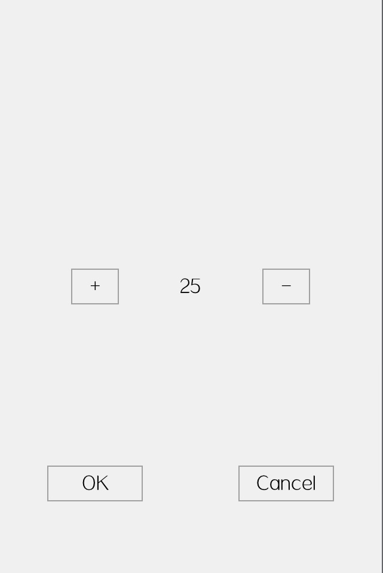

# awtk-inter-win-communication

## 介绍

本项目用于演示窗口之间的通信方式。

使用 AWTK 开发应用程序时，稍微复杂一点的项目，通常由多个窗口，窗口之间需要通信是常用的事。窗口之间的通信方式有多种，什么是窗口通信的正确姿势呢？本项目演示 4 种常见的通信方式，请根据自己的需要选择合适的方式。

在演示示例之中，有两个窗口：主窗口用于显示当前的温度，设置窗口用于修改当前的温度。

* 主窗口


点击窗口的 "Modify" 按钮后，打开设置窗口，修改完成之后更新主窗口的温度。

* 设置窗口



* 方式一：[直接修改主窗口的温度](src/by_direct/README.md)。

* 方式二：[通过窗口句柄修改主窗口的温度](src/by_win_handle/README.md)。

* 方式三：[通过回调函数，让主窗口自己修改主温度](src/by_callback/README.md)。

* 方式四：[通过 model 通知主窗口修改主温度](src/by_model/README.md)。

## 准备

1. 获取 awtk 并编译

```
git clone https://github.com/zlgopen/awtk.git
cd awtk; scons; cd -
```

2. 获取 awtk-inter-win-communication 并编译


* 下载

```
git clone https://github.com/zlgopen/awtk-inter-win-communication.git
cd awtk-inter-win-communication; 
```

* 生成资源

```
python ./scripts/update_res.py all
```

> 或者通过 designer 生成资源


* 编译PC版本

```
scons
```

* 编译LINUX FB版本

```
scons LINUX_FB=true
```

> 完整编译选项请参考[编译选项](https://github.com/zlgopen/awtk-widget-generator/blob/master/docs/build_options.md)

## 运行

```
./bin/demo_iwc_by_xxx
```

> 请把 xxx 换成具体的程序。
